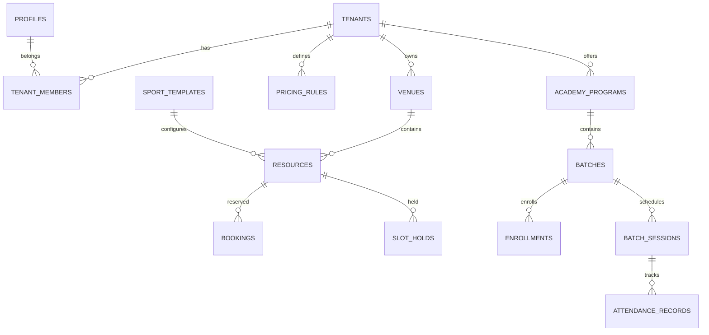

# PLAYHUB — Database Reference

**Module:** 2 — Database Foundation  
**Version:** 1.0  
**Last Updated:** 2026-07-09

---

## 1. Overview

PLAYHUB uses **PostgreSQL 15** via **Supabase** with a multi-tenant schema. All tenant-owned data is isolated using `tenant_id` columns and **Row Level Security (RLS)** policies.

| Property | Value |
|----------|-------|
| Tables | 26 |
| Enums | 11 |
| RPC functions | 4 |
| Realtime tables | 4 |
| Storage buckets | 3 |
| Migrations | 12 files |

---

## 2. Architecture Decision: Shared Schema Multi-Tenancy

**Decision:** Single database, shared schema, `tenant_id` on all tenant-scoped tables + RLS.

**Why:**
- Supabase free tier supports one project efficiently
- RLS enforces isolation at the database layer (defense in depth)
- Simpler operations than schema-per-tenant
- Standard PostgreSQL — portable if we migrate off Supabase

**Trade-off:** All tenants share connection pool; mitigated with indexes on `tenant_id` and pagination.

---

## 3. Entity Relationship Diagram

```
┌──────────────┐       ┌──────────────────┐       ┌──────────────┐
│ auth.users   │1────1│    profiles      │*─────*│tenant_members│
└──────────────┘       └────────┬─────────┘       └──────┬───────┘
                                │                        │
                    ┌───────────┼───────────┐              │
                    │           │         │              │
              ┌─────▼─────┐     │    ┌────▼────┐   ┌─────▼─────┐
              │guardian_  │     │    │bookings │   │  tenants  │
              │links      │     │    └────┬────┘   └─────┬─────┘
              └───────────┘     │         │              │
                                │         │         ┌────┴────────────────┐
                           ┌────▼────┐    │         │                     │
                           │notifi-  │    │    ┌────▼────┐          ┌─────▼─────┐
                           │cations  │    │    │ venues  │          │  academy  │
                           └─────────┘    │    └────┬────┘          │ programs  │
                                          │         │               └─────┬─────┘
                                          └───►│resources│◄───────────────────┤
                                               └────┬────┘                    │
                                                    │                  ┌──────▼──────┐
                                               ┌────▼────┐             │   batches   │
                                               │slot_    │             └──────┬──────┘
                                               │holds    │                    │
                                               └─────────┘         ┌──────────┼──────────┐
                                                                   │          │          │
                                                            ┌──────▼──┐ ┌─────▼────┐ ┌───▼────────┐
                                                            │batch_   │ │enroll-   │ │batch_      │
                                                            │coaches  │ │ments     │ │sessions    │
                                                            └─────────┘ └──────────┘ └─────┬──────┘
                                                                                          │
                                                                                    ┌─────▼──────┐
                                                                                    │attendance_ │
                                                                                    │records     │
                                                                                    └────────────┘
```

### Mermaid ERD (core domains)



---

## 4. Migration Files

| File | Purpose |
|------|---------|
| `20260709000001_auth_profiles.sql` | Profiles + auth trigger (Module 1) |
| `20260709000002_enums_extensions.sql` | Enums, `btree_gist` extension |
| `20260709000003_identity_tenancy.sql` | Guardians, tenants, members, invites |
| `20260709000004_venues_resources.sql` | Venues, resources, hours, blackouts |
| `20260709000005_booking.sql` | Bookings, holds, waitlist + overlap constraint |
| `20260709000006_pricing.sql` | Pricing, packages, promos |
| `20260709000007_academy.sql` | Academy programs, batches, attendance |
| `20260709000008_system.sql` | Templates, notifications, audit logs |
| `20260709000009_rls_helpers.sql` | `has_tenant_role()`, tenant_id sync triggers |
| `20260709000010_rls_policies.sql` | RLS policies for all tables |
| `20260709000011_functions.sql` | `create_booking`, `cancel_booking`, `create_enrollment` |
| `20260709000012_realtime_storage.sql` | Realtime publication + storage buckets |

**Rule:** Never edit applied migrations. Add new files for schema changes.

---

## 5. Enums

| Enum | Values |
|------|--------|
| `sport_type` | football, cricket, cricket_nets, pickleball, badminton, tennis, squash, basketball, volleyball, swimming |
| `academy_type` | running_academy, football_academy, cricket_academy, tennis_academy, swimming_academy, badminton_academy |
| `tenant_role` | owner, admin, manager, staff, coach, member |
| `booking_status` | pending, confirmed, cancelled, completed, no_show |
| `enrollment_status` | pending, active, suspended, completed, cancelled |
| `payment_status` | unpaid, paid, refunded, partial |
| `member_status` | active, invited, suspended |
| `tenant_status` | active, suspended |
| `waitlist_status` | waiting, notified, expired, fulfilled |
| `attendance_status` | present, absent, late, excused |
| `discount_type` | percentage, fixed |

TypeScript mirrors: `src/lib/database/enums.ts`

---

## 6. RLS Strategy

### Helper functions (SECURITY DEFINER)

| Function | Purpose |
|----------|---------|
| `is_platform_admin()` | Super-admin check |
| `is_tenant_member(tenant_id)` | Active membership check |
| `get_user_tenant_role(tenant_id)` | User's role in tenant |
| `has_tenant_role(tenant_id, min_role)` | Role hierarchy check |

### Role hierarchy (numeric levels)

```
owner (60) > admin (50) > manager (40) > staff (30) > coach (20) > member (10)
```

### Policy patterns

| Pattern | Example |
|---------|---------|
| Public read | Published venues, sport templates |
| Own data | `user_id = auth.uid()` for bookings |
| Tenant member | `is_tenant_member(tenant_id)` |
| Role-gated write | `has_tenant_role(tenant_id, 'manager')` |
| Platform admin | `is_platform_admin()` for templates, audit |

---

## 7. PostgreSQL Functions (RPC)

| Function | Purpose |
|----------|---------|
| `create_booking(...)` | Atomic slot reservation with `FOR UPDATE` lock |
| `cancel_booking(id, reason)` | Policy-aware cancellation |
| `create_enrollment(...)` | Capacity-checked enrollment |
| `expire_slot_holds()` | Cron job — delete expired holds |

Called from server via:
```typescript
const { data, error } = await supabase.rpc("create_booking", { ... });
```

---

## 8. Constraints

| Constraint | Table | Purpose |
|------------|-------|---------|
| `bookings_no_overlap` | bookings | GiST exclusion — no double booking |
| `enrollments_active_student_batch_idx` | enrollments | One active enrollment per student/batch |
| `attendance_records_unique` | attendance_records | One record per student per session |
| `venues_tenant_slug_unique` | venues | Unique slugs per tenant |

---

## 9. Indexes (key)

| Index | Table | Purpose |
|-------|-------|---------|
| `bookings_resource_time_idx` | bookings | Availability queries |
| `bookings_tenant_created_idx` | bookings | Dashboard lists |
| `venues_published_idx` | venues | Public discovery |
| `venues_geo_idx` | venues | Geo search |
| `tenant_members_user_id_idx` | tenant_members | Membership lookup |
| `notifications_unread_idx` | notifications | Unread count |

---

## 10. Realtime Publication

Tables published to `supabase_realtime`:

- `bookings` — live availability
- `slot_holds` — checkout holds
- `notifications` — in-app alerts
- `attendance_records` — coach dashboards

---

## 11. Storage Buckets

| Bucket | Public | Limit | Path pattern |
|--------|--------|-------|--------------|
| `avatars` | Yes | 2 MB | `{user_id}/` |
| `venue-media` | Yes | 5 MB | `{tenant_id}/` |
| `academy-media` | Yes | 5 MB | `{tenant_id}/` |

---

## 12. Seed Data

File: `supabase/seed.sql`

| Data | Count |
|------|-------|
| Sport templates | 10 (all sports) |
| Academy templates | 6 (all academies) |
| Demo tenant | 1 (`playhub-demo`) |
| Demo venues | 3 (Smash Arena, Aqua Sports, Green Field FC) |
| Demo resources | 8 courts/lanes/pitches |
| Operating hours | 7 days × 3 venues |
| Pricing rules | 5 |
| Academy program + batch | 1 + 1 |
| Promo code | PLAYHUB10 |
| Membership package | Badminton 10-Pack |

**Demo tenant UUID:** `11111111-1111-1111-1111-111111111111`  
TypeScript: `DEMO_IDS` in `src/lib/database/demo-ids.ts`

---

## 13. TypeScript Integration

| File | Purpose |
|------|---------|
| `src/types/database.types.ts` | Generated/manual Supabase types |
| `src/lib/database/enums.ts` | Sport/academy constants + labels |
| `src/lib/database/demo-ids.ts` | Seed UUID constants |
| `src/lib/supabase/client.ts` | Typed browser client |
| `src/lib/supabase/server.ts` | Typed server client |
| `src/lib/supabase/admin.ts` | Service-role client (server only) |

Regenerate types after schema changes:
```bash
npm run supabase:types   # local Supabase
```

---

## 14. Setup Commands

### Local development
```bash
supabase start
supabase db reset          # migrations + seed
npm run supabase:types
```

### Remote (production/staging)
```bash
supabase link --project-ref YOUR_REF
supabase db push
supabase db execute -f supabase/seed.sql   # optional demo data
```

### npm scripts
```bash
npm run db:push
npm run db:reset
npm run db:seed
```

---

## 15. Related Documents

- [docs/database-design.md](./docs/database-design.md)
- [docs/database-tables.md](./docs/database-tables.md)
- [docs/entity-relationship-diagram.md](./docs/entity-relationship-diagram.md)
- [docs/security-plan.md](./docs/security-plan.md)
- [TASKS.md](./TASKS.md)
- [ROADMAP.md](./ROADMAP.md)
