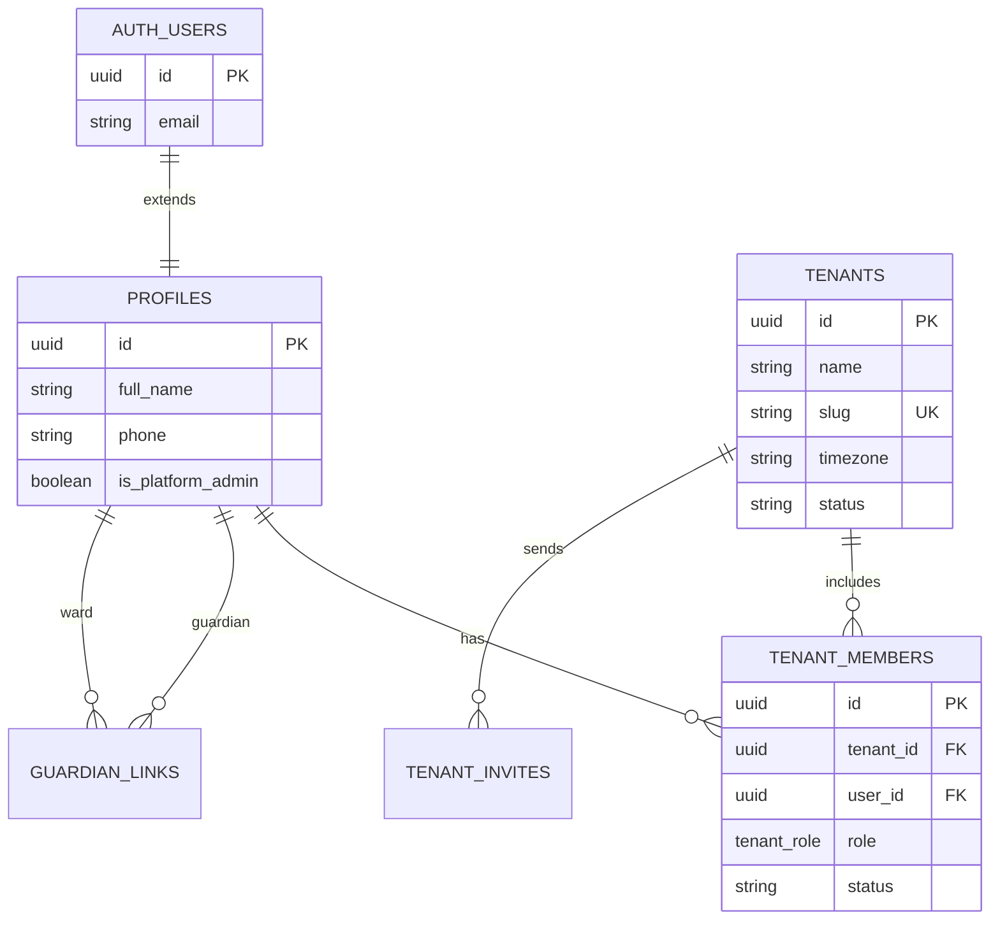
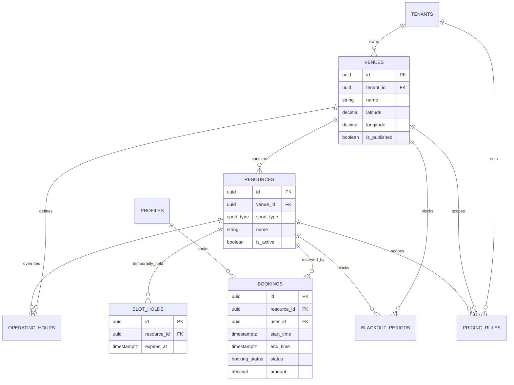
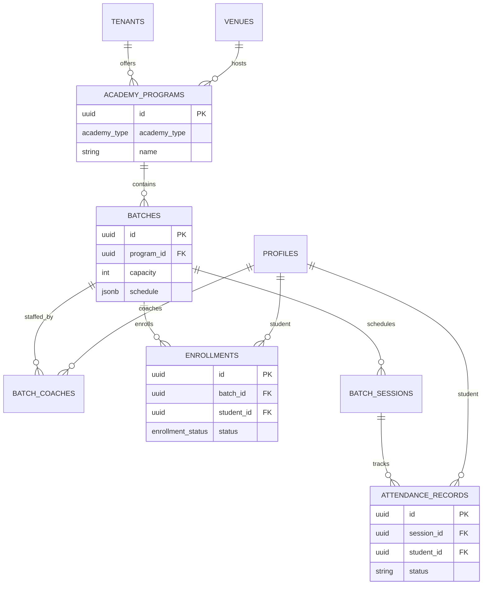
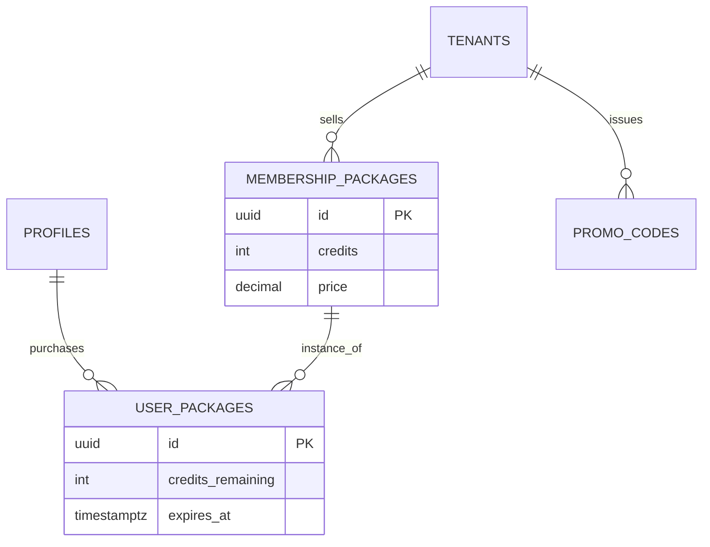

# Entity Relationship Diagram

**Product:** PLAYHUB  
**Version:** 0.1.0  
**Last Updated:** 2026-07-09

---

## 1. High-Level ERD

```
┌──────────────┐       ┌──────────────────┐       ┌──────────────┐
│ auth.users   │1────1│    profiles      │*─────*│tenant_members│
└──────────────┘       └────────┬─────────┘       └──────┬───────┘
                                │                        │
                    ┌───────────┼───────────┐              │
                    │           │         │              │
              ┌─────▼─────┐     │    ┌────▼────┐   ┌─────▼─────┐
              │guardian_  │     │    │bookings │   │  tenants  │
              │links      │     │    └────┬────┘   └─────┬─────┘
              └───────────┘     │         │              │
                                │         │         ┌────┴────────────────┐
                           ┌────▼────┐    │         │                     │
                           │notifi-  │    │    ┌────▼────┐          ┌─────▼─────┐
                           │cations  │    │    │ venues  │          │  academy  │
                           └─────────┘    │    └────┬────┘          │ programs  │
                                          │         │               └─────┬─────┘
                                          │    ┌────▼────┐                    │
                                          └───►│resources│◄───────────────────┤
                                               └────┬────┘                    │
                                                    │                  ┌──────▼──────┐
                                               ┌────▼────┐             │   batches   │
                                               │slot_    │             └──────┬──────┘
                                               │holds    │                    │
                                               └─────────┘         ┌──────────┼──────────┐
                                                                   │          │          │
                                                            ┌──────▼──┐ ┌─────▼────┐ ┌───▼────────┐
                                                            │batch_   │ │enroll-   │ │batch_      │
                                                            │coaches  │ │ments     │ │sessions    │
                                                            └─────────┘ └──────────┘ └─────┬──────┘
                                                                                          │
                                                                                    ┌─────▼──────┐
                                                                                    │attendance_ │
                                                                                    │records     │
                                                                                    └────────────┘
```

---

## 2. Tenancy & Identity Relationships



---

## 3. Venue & Booking Relationships



---

## 4. Academy Relationships



---

## 5. Commerce Relationships



---

## 6. Cardinality Reference

| Parent | Child | Relationship | Notes |
|--------|-------|--------------|-------|
| tenants | venues | 1:N | |
| venues | resources | 1:N | |
| resources | bookings | 1:N | Overlap prevented by constraint |
| profiles | bookings | 1:N | As player |
| academy_programs | batches | 1:N | |
| batches | enrollments | 1:N | Capacity limited |
| batches | batch_sessions | 1:N | |
| batch_sessions | attendance_records | 1:N | One per student per session |
| profiles | tenant_members | N:M | Via junction table |
| profiles | batch_coaches | N:M | Via junction table |

---

## 7. Key Foreign Key Graph

```
tenants (root)
  ├── venues
  │     ├── resources
  │     │     ├── bookings
  │     │     ├── slot_holds
  │     │     └── waitlist_entries
  │     ├── operating_hours
  │     ├── blackout_periods
  │     └── academy_programs
  │           └── batches
  │                 ├── batch_coaches
  │                 ├── enrollments
  │                 └── batch_sessions
  │                       └── attendance_records
  ├── tenant_members
  ├── pricing_rules
  ├── membership_packages
  │     └── user_packages
  └── promo_codes

profiles (global)
  ├── tenant_members
  ├── bookings (as user_id)
  ├── enrollments (as student_id)
  ├── notifications
  └── audit_logs (as actor_id)
```

---

## 8. Denormalization Notes

| Field | Table | Reason |
|-------|-------|--------|
| `sport_type` | bookings | Avoid join for sport-filtered reports |
| `tenant_id` | bookings, enrollments, etc. | RLS performance — filter without joins |
| `email` | profiles | Display without auth.users join |

---

## 9. Related Documents

- [Database Tables](./database-tables.md)
- [Database Design](./database-design.md)
- [API Design](./api-design.md)
